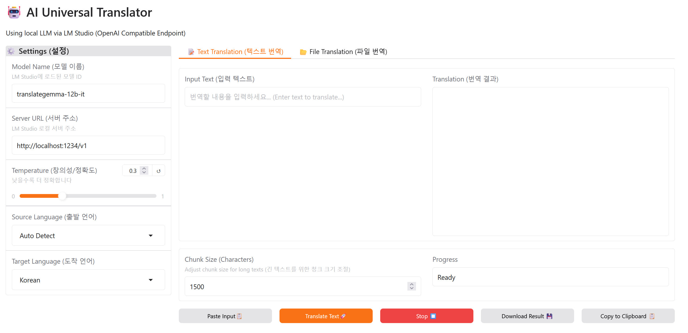

# 🤖 Python LLM Translator

A powerful, user-friendly local translation tool built with **Python**, **Gradio**, and **LM Studio**. Translate text and files privately using local Large Language Models (LLMs).



## ✨ Features

*   **🏠 100% Local & Private**: Leveraging [LM Studio](https://lmstudio.ai/), all translations happen on your machine.
*   **📝 Smart Text Translation**:
    *   **Streaming Output**: Watch the translation as it generates.
    *   **Auto-Chunking**: Automatically splits long texts to bypass context window limits.
    *   **Clipboard Integration**: One-click **Paste Input** and **Copy Result**.
    *   **File Export**: Download translation results as `.txt` files.
*   **📂 File Translation**:
    *   Upload and translate large text files (`.txt`, `.md`, `.py`, `.json`, etc.).
    *   Progress tracking for chunk-based processing.
    *   View real-time preview and download the final translated file.
*   **🌍 Multi-Language Support**: Pre-configured for English, Korean, Japanese, Chinese, Spanish, French, German, and Russian (extensible code).

## 🚀 Prerequisites

1.  **Python 3.8+**
2.  **LM Studio**
    *   Download from [lmstudio.ai](https://lmstudio.ai/).
    *   You need to load a model (e.g., `translategemma-12b-it`) capable of translation.

## 📦 Installation

1.  **Clone the repository** (or download usage files):
    ```bash
    git clone https://github.com/your-username/python-llm-translator.git
    cd python-llm-translator
    ```

2.  **Install dependencies**:
    ```bash
    pip install -r requirements.txt
    ```
    *Dependencies include: `gradio`, `openai`, `pyperclip`*

## 🛠️ Application Usage

1.  **Start LM Studio Server**:
    *   Open **LM Studio**.
    *   Go to the **Local Server** ( `<->` icon ) tab.
    *   Load your preferred LLM.
    *   Click **Start Server**. (Default: `http://localhost:1234`)

2.  **Run the Translator**:
    ```bash
    python app.py
    ```

3.  **Translate**:
    *   The web interface will open automatically at `http://127.0.0.1:7860`.
    *   **Settings**: Ensure the `Server URL` matches LM Studio (default is correct).
    *   **Chunk Size**: Adjust if you experience context limit errors (default: 1500 chars).

## 🧩 Key Functionalities

### Text Translation Tab
*   **Paste Input**: Uses `pyperclip` to safely paste content from your clipboard.
*   **Translate**: Streams the response. Large texts are broken into segments and translated sequentially.
*   **Download/Copy**: Save the result easily.

### File Translation Tab
*   Upload a file and wait for the chunk-by-chunk processing.
*   The result is saved with a `translated_` prefix in the original directory (or via download button).

## ❓ Troubleshooting

*   **Clipboard Error**: If "Paste" doesn't work, ensure you are running the app locally. Browsers block clipboard access on non-secure (non-https) remote connections.
*   **Connection Refused**: Check if LM Studio Server is actually running and the port is `1234`.
*   **Weird Translations**: Try lowering the **Temperature** (e.g., 0.1 - 0.3) for more literal translations, or try a different Model.

## 📜 License

This project is open-source. Feel free to modify and distribute.
